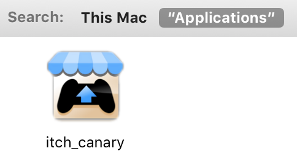

# Continuous deployment

itch is continuously being built, tested, and deployed, to help us keep it high-quality and low on bugs.

## Repository setup

The main repository for itch is hosted on GitHub:

* [https://github.com/itchio/itch](https://github.com/itchio/itch)

Builds, code signing, and publishing are all handled by GitHub Actions. The CI
workflow runs multi-platform builds, signs executables (Azure Code Signing for
Windows, Apple notarization for macOS), and publishes releases to itch.io using
[butler](https://itch.io/docs/butler/). Releases are also published as GitHub
Releases.

## Build scripts

GitHub Actions uses a YAML workflow configuration file. Its format is detailed in the [GitHub Actions](https://docs.github.com/en/actions) documentation.

itch's [CI workflow](https://github.com/itchio/itch/blob/master/.github/workflows/build.yml) is relatively straight-forward, most of the complexity lives in individual shell scripts in the `release/` directory.

### Testing

* **Type checking**: CI runs the TypeScript compiler in check mode on every commit to catch compile errors
* **Integration tests**: Go-based integration tests run against the packaged binary after each build

### Building

TypeScript is compiled via [esbuild](https://esbuild.github.io/) into two bundles, one for the main process and one for the renderer.

Static assets are copied to the build output and a minimal `package.json` is generated with the correct app name and version.

### Packaging

All platforms use [`@electron/packager`](https://www.npmjs.com/package/@electron/packager) to produce a portable Electron application directory. The app is not archived into an ASAR.

#### Windows

`@electron/packager` produces an `.exe` with resources. The executable is signed in a separate CI job using Azure Code Signing.

#### macOS

`@electron/packager` produces `.app` bundles for both x64 and arm64 architectures. A separate CI job signs the bundles with `@electron/osx-sign` and notarizes them with `@electron/notarize`.

#### Linux

`@electron/packager` produces an application directory, tarballed to preserve file permissions.

### Publishing releases

* **On every push/PR**: The workflow builds and type-checks on all three platforms, but does not upload artifacts, sign, or publish. This validates that the code compiles and packages correctly.
* **On `workflow_dispatch`**: The full pipeline runs -- build, code signing (separate jobs for Windows and macOS), and artifact upload. If the dispatch is triggered on a git tag, two additional jobs run:
  * **GitHub Release**: Creates a release (marked as prerelease if the tag contains "canary") with `.tar.gz` archives for all platforms
  * **itch.io deployment**: Downloads all signed artifacts, validates macOS bundle structure, and uses butler to push to the appropriate itch.io channel (`itchio/itch` or `itchio/kitch`)

Downloads are available at:

* [https://itchio.itch.io/itch-setup](https://itchio.itch.io/itch-setup)
* [https://itchio.itch.io/itch](https://itchio.itch.io/itch)
* [https://itchio.itch.io/kitch](https://itchio.itch.io/kitch)
* [https://itchio.itch.io/install-itch](https://itchio.itch.io/install-itch)
* [https://itchio.itch.io/install-kitch](https://itchio.itch.io/install-kitch)

## The canary channel

When making large structural changes, it is sometimes useful to have a completely separate version of the app with no expectations of stability.

`kitch` is exactly that. It is meant to be installed in parallel of the stable app, and has a distinct branding \(blue instead of itch.io hot pink\), uses different folders \(`%APPDATA%/kitch`, `~/.config/kitch`, `~/Library/Application
Support/kitch`\).

### Differences between itch and kitch

| Feature | itch (Stable) | kitch (Canary) |
|---------|---------------|----------------|
| **URL Protocols** | `itchio://`, `itch://` | `kitchio://`, `kitch://` |
| **Broth Channels** | Standard format (e.g. `darwin-amd64`) | `-head` suffix (e.g. `darwin-amd64-head`) |
| **Version Constraints** | butler `^15.20.0`, itch-setup `^1.8.0` | None -- always fetches latest |
| **macOS Bundle ID** | `io.itch.mac` | `io.kitch.mac` |
| **Icons/Assets** | `src/static/images/tray/itch.png` | `src/static/images/tray/kitch.png` |
| **Binary Name** | `itch` | `kitch` |

### How variants are determined

**At build time:** The variant is selected based on git tags. A tag containing the `-canary` suffix produces a kitch build, while all other tags produce itch. The default `package.json` name is `"kitch"`, so local development always runs as kitch.

**At runtime:** The app calls `app.getName()` to read the package.json name field, which sets `env.isCanary`, `env.appName`, and `env.channel` accordingly.

### Downloads

It can be downloaded from itch.io:

* [https://itchio.itch.io/install-kitch](https://itchio.itch.io/install-kitch)
* [https://itchio.itch.io/kitch](https://itchio.itch.io/kitch)

Additionally:

* **Do** expect the canary version to break on occasion
* **Do** report back if you try it and you've found an issue that doesn't seem
  to be on the [issue tracker](https://github.com/itchio/itch/issues)
