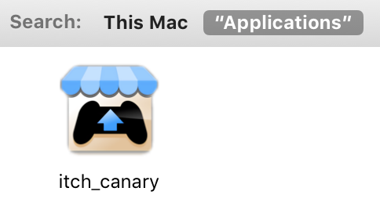

# Continuous deployment

itch is continuously being built, tested, and deployed, to help us keep it high-quality and low on bugs.

To do so, we run our own instance of [GitLab CI](https://docs.gitlab.com/ce/ci/):

* [https://git.itch.ovh](https://git.itch.ovh)

## Git mirroring

Since the main repository for itch is [on GitHub](https://github.com/itchio/itch), and since GitLab CI will only build projects that are hosted on a GitLab instance, itch and associated projects have pages on our GitLab instance:

* [https://git.itch.ovh/itchio/itch](https://git.itch.ovh/itchio/itch)

Developers don't have to worry about the GitLab project page: they should clone the repository from the Github remote and push to it, as usual. The GitHub project has a webhook that POSTs a signed payload to a custom service, `git-mirror`, which fetches from Github and pushes to GitLab on-demand:

* [https://github.com/fasterthanlime/git-mirror](https://github.com/fasterthanlime/git-mirror)

## Build scripts

GitLab CI has a simple YAML configuration file, similar to Travis CI. Its format is detailed in the [GitLab CI](https://docs.gitlab.com/ce/ci/) documentation, and can be validated using the [CI lint](https://git.itch.ovh/ci/lint) page.

itch's [CI config](https://github.com/itchio/itch/blob/master/.gitlab-ci.yml) is relatively straight-forward, most of the complexity lives in individual shell scripts in the `release/` directory.

### Book generation

The book you're reading right now is compiled from Markdown to HTML using [gitbook](https://www.npmjs.com/package/gitbook) on every commit.

It is then uploaded to `https://docs.itch.ovh/itch/REF`, where `REF` is either  
a branch, like `master`, or a tag, like `v0.14.0-canary`.

As a result, the bleeding-edge version of this book is always available at:

* [https://itch.io/docs/itch](https://itch.io/docs/itch)

### Unit tests & linting

The codebase is covered by a certain amount of unit tests, in `src/tests`.

On every commit, the CI executes all unit tests, and runs the TypeScript compiler in check mode to make sure that there are no compile errors.

### Building

The building scripts run some common steps on every platform:

* Compiling [TypeScript](https://www.typescriptlang.org/) code to ES2017, into several bundles
* Copying some asset files \(vendor CSS/JS/images\)

### Packaging

#### Windows

.exe + resources is built with [electron-packager](https://www.npmjs.com/package/electron-packager), then [electron-winstaller](https://github.com/electron/windows-installer) generates `-full.nupkg`, `-delta.nupkg`, and `RELEASES`, needed for Squirrel.Windows update.

#### macOS / OS X

.zip is built with `7za` \(7-zip command-line\), .dmg is built with [node-appdmg](https://www.npmjs.com/package/appdmg), with a custom background made in GIMP.

#### Linux

The .desktop file is generated via `release/X.desktop.in` files + `sed`. All locale files are parsed for translations of the app's name and description.

deb & rpm packages are generated thanks to [fpm](https://github.com/jordansissel/fpm), and uploaded to [Bintray](https://bintray.com/itchio) with [dpl](https://rubygems.org/gems/dpl).

### Uploading to GitHub releases

All artifacts are uploaded to the relevant GitHub release pages:

* [https://github.com/itchio/itch/releases](https://github.com/itchio/itch/releases)
* [https://github.com/itchio/kitch/releases](https://github.com/itchio/kitch/releases)

...using [gothub](https://github.com/itchio/gothub), a golang uploader.

_Our fork adds the _`-R`_ command-line option, which replaces an asset if it already exists, and is necessary to retry failed uploads to GitHub \(which used to happen a lot\)._

### Actually publishing the release

The automated pipeline only creates a release _draft_ on GitHub - it still needs to be approved by a human before the update server starts serving it to users.

Similarly, [Bintray](https://bintray.com/itchio) packages are created in draft mode and have to be published by hand. The actual "ship it" process looks like:

* Receive phone notification that release is ready \(via [Pushover](https://pushover.net/)\)
* Make sure everything looks good
* Edit GitHub draft release, publish it
* Check out both rpm and deb repos on [Bintray](https://bintray.com/itchio), publish unpublished packages.

## The canary channel

When making large structural changes, it is sometimes useful to have a completely separate version of the app with no expectations of stability.

`kitch` is exactly that. It is meant to be installed in parallel of the stable app, and has a distinct branding \(blue instead of itch.io hot pink\), uses different folders \(`%APPDATA%/kitch`, `~/.config/kitch`, `~/Library/Application  
Support/kitch`\).

It can be downloaded either:

* From the update server: [https://nuts-canary.itch.ovh/download](https://nuts-canary.itch.ovh/download)
* Directly from the releases page: [https://github.com/itchio/kitch/releases](https://github.com/itchio/kitch/releases)

_Note that releases appear out-of-order on the releases page, because GitHub associates them all with the same commit, since _`kitch`_ is actually an empty repository._

Additionally:

* **Do** expect the canary version to break on occasion
* **Do** report back if you try it and you've found an issue that doesn't seem
  to be on the [issue tracker](https://github.com/itchio/itch/issues)

