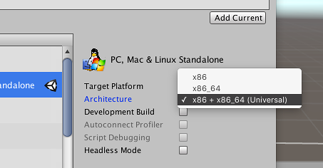

# Distributing Linux builds

Two simple steps:

* Make a **portable build**
* **Push it with **[**butler**](https://itch.io/docs/butler)

> For other approaches, see the [Compatibility policy](/integrating/compatibility-policy.md) page.

## Portable builds for common game engines \(Unity, etc.\)

Game engines like Unity take care of bundling any required libraries directly in their export - some of them will give you a folder that you can just compress and upload to itch.io, the app will install and run them, no questions asked.

For Unity in particular, you can use the 'Universal' export option that is similar to the manual method described below:



## Portable builds

If you're compiling binaries yourselves, either using a lower-level game engine, or coding your own, then you need to bundle the required libraries yourself.

This section describes one possible way to go about it - the details are up to you.

### 1. Distribute a simple archive

Use a simple archive rather than .deb or .rpm packages. See the [Compatibility policy](/integrating/compatibility-policy.md) for more details.

Simply **put your assets, executables and libraries in a folder**, and push it with butler.

### 2. Structure your build

Structure your game with separate folders for assets, binaries, and libraries:

```
foobar-v1.0.0/
  foobar
  assets/
  lib/
    libbaz.so.2.1.3
  bin/
    foobar.x86_64
```

_In the above, names ending with a _`/`_ are folders, whereas other names are files_

The `assets` folder contains music, sound effects, textures, level data, whereas the `lib` folder contains the dynamic libraries your executable requires.

The `foobar` file is a launcher script following this structure:

```bash
#!/bin/bash

# Move to script's directory
cd "`dirname "$0"`"

# Set the libpath and run the binary
export LD_LIBRARY_PATH=$LD_LIBRARY_PATH:./lib/
./bin/foobar.x86_64 $@
```

### Finding which libraries you need to include

The `ldd` tool prints a list of libraries an executable depends on. Here's its output on the 64-bit executable of an [example SDL2-based game](https://fasterthanlime.itch.io/behind-the-fence):

```
$ ldd bins/plant64
    linux-vdso.so.1 =>  (0x00007ffd7c771000)
    libSDL2-2.0.so.0 => not found
    libpthread.so.0 => /lib/x86_64-linux-gnu/libpthread.so.0 (0x00007f24f38ff000)
    libm.so.6 => /lib/x86_64-linux-gnu/libm.so.6 (0x00007f24f35f6000)
    libfreetype.so.6 => /usr/lib/x86_64-linux-gnu/libfreetype.so.6 (0x00007f24f3350000)
    libdl.so.2 => /lib/x86_64-linux-gnu/libdl.so.2 (0x00007f24f314c000)
    libGLEW.so => not found
... (cut for readability)
```

The output is sizable, we can cut it down by piping ldd's output into `grep`:

```
$ ldd bins/plant64 | grep 'not found'
    libSDL2-2.0.so.0 => not found
    libGLEW.so => not found
```

In this example, the Linux installation on which this command was run is missing  
SDL2 and GLEW. Adding those in `lib64` folder, we can check that we didn't miss  
any by setting `LD_LIBRARY_PATH` while running ldd:

```
$ LD_LIBRARY_PATH='lib64' ldd bins/plant64 | grep 'not found'
```

The lack of output is a good sign! All libraries have been found. Indeed,  
running the game with the right library path works:

```
$ LD_LIBRARY_PATH='lib64' bins/plant64
... (normal game output)
```

Whereas running it _without_ the bundled libraries crashes immediately:

```
$ bins/plant64
bins/plant64: error while loading shared libraries: libSDL2-2.0.so.0: cannot open shared object file: No such file or directory
```

**Important note:** `glibc` and `libstdc++` are libraries you usually do \_not \_want to bundle. Just make sure your application doesn't depend on a version of them that is too recent \(as explained below\).

The same advice applies to most `libGL*.so` libraries — don't bundle your own graphic card's drivers!

### Automatically copying needed libraries

If you're looking for an automated solution to the previous steps, you can use the [`copydeps`](https://github.com/suve/copydeps) tool to identify and copy all of your application's dependencies.

**Note:** While `copydeps` can save you the labour of manually finding and copying the shared object files, it's still heavily recommended to verify if the application runs correctly and whether you're not bundling any excessive libraries.

### GLIBC compatibility

As a developer, you might be running the latest and greatest version of your Linux distribution - but your players might not.

Binaries compiled on recent version of [Ubuntu](http://www.ubuntu.com/), for example, might fail on older [Fedora](https://getfedora.org/) versions. This is often because of the GLIBC version your executable is linked against.

One way to avoid this problem entirely is to produce **fully static binaries** using [musl libc](https://musl.libc.org/) instead of GLIBC. Languages like Rust and Go have built-in support for static linking with musl, and you can also use [musl-cross](https://github.com/richfelker/musl-cross-make) toolchains for C/C++. Static binaries have no system library dependencies, so they'll run on virtually any Linux distribution.

If static linking isn't an option, you'll want to target an older GLIBC version. While bundling the dynamic libraries you use is relatively easy, linking against a different GLIBC version is a whole other matter.

You can check the GLIBC versions required by a binary with this one-liner:

```bash
objdump -T your_binary | grep GLIBC | sed 's/.*GLIBC_\([.0-9]*\).*/\1/g' | sort -u
```

For a more robust solution, see [glibc-check.sh](https://gist.github.com/fasterthanlime/17e002a8f5e0f189861c). Here's its output when run against the example game mentioned above:

```
$ ./glibc-check.sh behindthefence/bins/plant64
Found version 2.2.5
Found version 2.3
Found version 2.3.2
Found version 2.3.3
```

By making sure that the GLIBC version your executable depends on is old enough, you'll ensure maximum compatibility with your players' sofware. Since it's hard to link against an older GLIBC version, there's a few different ways to produce your distribution builds \(that don't involve rebooting\)

#### Using virtual machines \(VM\)

You can use [QEMU](https://www.qemu.org/) \(or [virt-manager](https://virt-manager.org/) for a GUI\) with a Linux image to produce your executables and all required libraries.

Take an older Debian \(11 Bullseye, for example\), build your dependencies yourself in a prefix, and you'll be sure your game can run almost anywhere. You can refer to the [Building Linux software into a prefix](../../appendix/building-into-a-prefix.md ) appendix to learn more about how and why do it.

#### Building in chroots

chroots are \(in layman's terms\) a way to run a Linux distribution within a Linux distribution. Although they are harder to setup than just grabbing a VM image, they are also much lighter, since you don't need to emulate a whole x86 computer and dedicate a whole portion of your RAM to it.

If you want to set up a chroot of an older Debian, for example, you'll need a 64-bit host \(a recent Ubuntu, for example\).

The [Debootstrap](https://wiki.debian.org/Debootstrap) family of tools is particularly helpful for setting debian chroots.

#### Using GitHub Actions with older runners

[GitHub Actions](https://github.com/features/actions) lets you build on older Ubuntu LTS runners \(e.g. `ubuntu-22.04`\), which will link against an older GLIBC and improve compatibility with your players' systems. You can also set up a workflow to automatically push builds to itch.io with [butler](https://itch.io/docs/butler) on every release.

### 3. Get testers!

Even when following all the advice in this page to the letter, mistakes are easy to make. The best way to make sure your game runs everywhere is to have people everywhere run it.

itch.io and the itch app make it easy to give other people access to a yet-unreleased game. Refer to the [Distributing pre-release builds with itch.io](https://itch.io/t/13498/distributing-pre-release-builds-with-itchio) guide for an overview of your various options.

_Don't forget to mention testers in your software's credits. Testers can make or break software._

## Further reading

* Ethan Lee wrote a guide on [how he packages Linux games using MojoSetup](https://gist.github.com/flibitijibibo/b67910842ab95bb3decdf89d1502de88)
* His [Magfest 2016 slides](http://www.flibitijibibo.com/magfest2016/) covers a bunch of cross-platform development subjects out of the scope of this book.
* The FNA wiki also has a [similar article](https://github.com/FNA-XNA/FNA/wiki/3:-Distributing-FNA-Games#gnulinux>)
* The freegamedev Wiki has a [Portable binaries](http://freegamedev.net/wiki/Portable_binaries) page that goes in the same direction. It also covers the 'rpath' approach, not mentioned in this book.

The MojoSetup approach is friendly both for manual installations and is a supported  
installation method in the itch app.

_Special thanks to Ethan Lee for proofreading this page and contributing advice.  
See the Acknowledgements section of this book for a full list of contributors._

